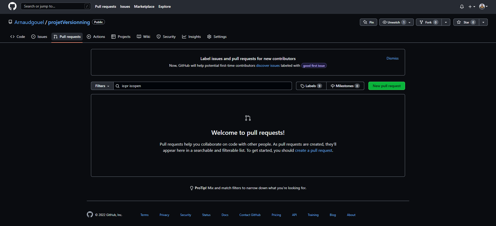

# Clone the project via SSH

`git clone git@github.com:Arnaudgouel/projetVersionning.git`

# Create Branch into repository

`git checkout -b <branchName>`

# Stage changes

`git add <fileName>`

# Commit changes

`git commit -m "<commitDescription>"`

## Commit's name conventions

[Go to official site](https://www.conventionalcommits.org/en/v1.0.0/)

- `fix:` changes that patches a bug in your codebase (**PATCH** version)
- `feat:` changes that introduce a new feature to your codebase (**MINOR** version)
- `docs:` Documentation only change

# Workflow
1. Se placer sur la branche principale (staging) et se mettre à jour `git pull origin staging`
1. Création d'une nouvelle branche (**Respecter la convention de nommage comme pour les commit, le nom de branche doit être la synthèse des commits de cette branche**) pour effectuer un développement `git checkout -b <branchName>`
1. Effectuer les commits nécessaires
1. Envoyer les commits sur le repo distant
1. Créer une pull request sur github 
1. Mettre en reviewer une autre personne pour qu'elle valide les changements
